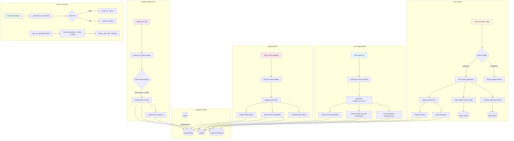

# 8x Hiring Template

A modern SaaS starter template for frontend engineering assessments. Built with Next.js 16, React 19, TypeScript, Tailwind CSS, and Supabase.

## Project Overview

Genify.ai is a locally runnable SaaS demo. It includes authentication, pricing and subscription flows, a credit-based video generation feature, and a production-style Supabase backend with RLS and RPCs. The goal is to demonstrate clean UX, safe data access patterns, and a realistic end‑to‑end workflow without real AI or payments.

Key highlights:
- Auth with Supabase (sign up/in/out)
- Subscription tiers with credits and fake checkout
- Video generation flow with preview states, history, and detail pages
- Secure database design (RLS, RPCs, audit ledger)
- Polished UI across pricing, profile, privacy, and generation screens

## Index

- [Project Setup](#project-setup)
  - [Prerequisites](#prerequisites)
  - [Local Setup](#local-setup)
  - [Environment Variables](#environment-variables)
  - [Run the App](#run-the-app)
  - [Tech Stack](#tech-stack)
  - [Features](#features)
  - [Project Structure](#project-structure)
  - [Useful Commands](#useful-commands)
- [Database](#database)
  - [Database Schema](#database-schema)
  - [Database Architecture](#database-architecture)
    - [System Flow](#system-flow)
  - [Database Security Summary](#database-security-summary)
    - [Row-Level Security Policies](#row-level-security-policies)
    - [Permission Model](#permission-model)
    - [Secure Functions (RPCs)](#secure-functions-rpcs)
    - [Security Features](#security-features)
    - [Security Principles](#security-principles)
    - [Data Access Patterns](#data-access-patterns)
    - [Production Hardening](#production-hardening)
- [User Journey Flow](#user-journey-flow)
- [Notes](#notes)

## Loom Demo

https://www.loom.com/share/18f4ba62a329408fa410afec638f4405

## Project Setup

### Prerequisites

- [Node.js](https://nodejs.org/) (v20+)
- [pnpm](https://pnpm.io/) (or npm/yarn)
- [Docker](https://www.docker.com/) (for local Supabase)
- [Supabase CLI](https://supabase.com/docs/guides/cli)

### Local Setup

1. **Clone the repository**
   ```bash
   git clone <repo-url>
   cd 8x-hiring-template
   ```

2. **Install dependencies**
   ```bash
   pnpm install
   ```

3. **Start local Supabase**
   ```bash
   supabase start
   ```

4. **Reset the local database and apply migrations**
   ```bash
   supabase db reset
   ```

### Environment Variables

5. **Create `.env.local`**
   ```bash
   cp .env.example .env.local
   ```

6. **Fill in Supabase keys** from `supabase start` output:
   ```
   API URL: http://127.0.0.1:54521
   Publishable key: sb_publishable_...
   Secret key: sb_secret_...
   ```

   ```
   NEXT_PUBLIC_SUPABASE_URL="http://127.0.0.1:54521"
   NEXT_PUBLIC_SUPABASE_PUBLISHABLE_KEY="<your-publishable-key>"
   SUPABASE_SERVICE_ROLE_KEY="<your-secret-key>"
   ```

### Run the App

7. **Start development server**
   ```bash
   pnpm dev
   ```

8. **Open** [http://localhost:3000](http://localhost:3000)

## Tech Stack

- **Framework**: Next.js 16 (App Router)
- **Language**: TypeScript
- **UI**: React 19 + Tailwind CSS + Shadcn/ui
- **Database**: Supabase (PostgreSQL)
- **Auth**: Supabase Auth (email/password)

## Features

- User authentication (sign up, sign in, sign out)
- Protected routes
- Subscription tiers (Free / Pro)
- Profile management
- Account deletion
- Responsive design
- Dark mode support

## Project Structure

```
├── app/                    # Next.js App Router pages
│   ├── api/               # API routes
│   ├── auth/              # Auth pages (login, signup)
│   ├── generate/          # Video generation + history
│   ├── pricing/           # Pricing + fake checkout
│   ├── profile/           # User profile
│   ├── privacy/           # Privacy policy
│   └── terms/             # Terms page
├── components/            # Reusable UI components
│   ├── generate/          # Generation UI + preview panels
│   ├── pricing/           # Pricing UI
│   └── profile/           # Profile UI
├── contexts/              # React Context providers
├── lib/                   # Utilities and Supabase clients
└── supabase/              # Database migrations
```

## Useful Commands

```bash
pnpm dev          # Start development server
pnpm build        # Build for production
pnpm lint         # Run ESLint
supabase start    # Start local Supabase (applies migrations)
supabase stop     # Stop local Supabase
supabase studio   # Open Supabase Studio (local admin UI)
```

## Database

### Database Schema

This project uses a production-style schema:

```sql
plans, subscriptions, credits, credit_transactions, generations, demo_videos
```

Schema snapshot:


### Database Architecture


#### System Flow



Note: The cron job shown here (for monthly topups/tier checks) is included in the schema but is not invoked in this repo. In production it’s typically triggered by Stripe webhooks or a scheduler.

### Database Security Summary

#### Row-Level Security Policies

| Table | Policy Name | Type | Rule |
| --- | --- | --- | --- |
| plans | Plans viewable by everyone | SELECT | is_active = true |
| subscriptions | Users view own subscription | SELECT | auth.uid() = user_id |
| credits | Users view own credits | SELECT | auth.uid() = user_id |
| credit_transactions | Users view own transactions | SELECT | auth.uid() = user_id |
| generations | Users view own generations | SELECT | auth.uid() = user_id |

#### Permission Model

| Table | Authenticated Users | Anonymous Users |
| --- | --- | --- |
| plans | ✅ SELECT only | ✅ SELECT only |
| subscriptions | ✅ SELECT (RLS enforced) | ❌ No access |
| credits | ✅ SELECT (RLS enforced) | ❌ No access |
| credit_transactions | ✅ SELECT (RLS enforced) | ❌ No access |
| generations | ❌ No direct access | ❌ No access |
| demo_videos | ❌ No direct access | ❌ No access |

#### Secure Functions (RPCs)

**User-callable**
- `get_my_dashboard()` → plan + credits snapshot
- `upgrade_plan(slug)` → subscription change + credits topup
- `spend_credits(amount, reason)` → atomic credit deduction
- `create_generation(...)` → tier validation + credit spend + generation insert

**Admin-only**
- `process_monthly_topups()` → scheduled credit topups
- `handle_new_user()` → trigger-only signup setup

#### Security Features

- **Trigger-based setup**: `handle_new_user()` provisions subscription + credits on signup.
- **Atomic operations**: all credit changes use `FOR UPDATE` to prevent race conditions.
- **Input validation**: `CHECK` constraints enforce valid statuses and positive balances.
- **Audit trail**: every credit movement is recorded in `credit_transactions`.
- **Tier-based enforcement**: free tier restrictions are enforced in `create_generation`.
- **Safe read model**: `generations_safe` masks `result_url` for free users.

#### Security Principles

| Principle | Implementation |
| --- | --- |
| Least Privilege | Only SELECT is granted; all writes go through RPCs |
| Defense in Depth | RLS + RPC validation + database constraints |
| Auditability | All credits changes logged in `credit_transactions` |
| Atomicity | `FOR UPDATE` locking on credit balance operations |
| No Leaky Columns | `generations_safe` hides paid-only `result_url` |
| SQL Safety | `SECURITY DEFINER` functions with explicit `search_path` |

#### Data Access Patterns

**User can**
- View their own subscription, credits, transactions, and generations
- View all active plans
- Call safe RPCs (upgrade, spend credits, create generation)

**User cannot**
- View other users’ data
- Write to credits, subscriptions, or generations directly
- Call admin-only functions
- Bypass tier restrictions or see paid-only result URLs

#### Production Hardening

- **Idempotency**: `ON CONFLICT` in signup and plan seeding.
- **Tolerance**: signup trigger gracefully handles missing plans.
- **Performance**: indexes on user_id, created_at, and next_topup_at.
- **Monitoring**: generations status tracking + credit ledger for audits.
- **Production-ready access control**: no direct table writes from clients.

#### Why This Design Works In Production

- Clear separation of **read** vs **write** paths (views for reads, RPCs for writes).
- Tier enforcement happens at the **database boundary**, not just in UI.
- Credit changes are **auditable and atomic**, preventing balance drift.
- RLS ensures **tenant isolation** even if client queries are compromised.

### User Journey Flow

```mermaid
sequenceDiagram
    participant U as User
    participant F as Frontend
    participant SB as Supabase Auth
    participant DB as Database
    participant T as Triggers
    participant RPC as RPC Functions

    Note over U,RPC: 1. SIGNUP FLOW
    U->>F: Sign up with email/password
    F->>SB: auth.signUp()
    SB->>DB: INSERT auth.users
    DB->>T: TRIGGER: handle_new_user()
    activate T
    T->>DB: INSERT subscriptions (Free plan)
    T->>DB: INSERT credits (balance: 100)
    T->>DB: INSERT credit_transactions (signup_bonus)
    T-->>SB: User created successfully
    deactivate T
    SB-->>F: Session token
    F-->>U: Redirect to /video-generation

    Note over U,RPC: 2. VIEW DASHBOARD
    U->>F: Navigate to profile
    F->>RPC: get_my_dashboard()
    activate RPC
    RPC->>DB: SELECT subscriptions JOIN plans JOIN credits
    DB-->>RPC: {plan: "Free", credits: 100}
    RPC-->>F: Dashboard data
    deactivate RPC
    F-->>U: Display: Free plan, 100 credits

    Note over U,RPC: 3. GENERATE VIDEO (First Time)
    U->>F: Fill form: prompt, model, aspect_ratio
    F->>F: Check: is tier = 'free' AND model = 'sora'?
    Note over F: Frontend validation (optional)
    F->>RPC: create_generation(...)
    activate RPC
    RPC->>DB: SELECT subscription + plan (tier check)
    DB-->>RPC: tier = 'free'
    RPC->>RPC: Validate: free cannot use Sora
    alt Settings Not Allowed
        RPC-->>F: ERROR: "Upgrade to Pro"
        F-->>U: Show upgrade modal
    else Settings Allowed
        RPC->>RPC: Call spend_credits(30, 'video_generation')
        activate RPC
        RPC->>DB: SELECT credits FOR UPDATE
        DB-->>RPC: balance = 100
        RPC->>DB: UPDATE credits SET balance = 70
        RPC->>DB: INSERT credit_transactions (spend, -30)
        RPC-->>RPC: Credits deducted
        deactivate RPC
        RPC->>DB: SELECT random demo_video
        DB-->>RPC: video_url
        RPC->>DB: INSERT generations
        RPC-->>F: generation_id
        deactivate RPC
        F-->>U: Show video preview
    end

    Note over U,RPC: 4. VIEW GENERATION HISTORY
    U->>F: Navigate to /history
    F->>DB: SELECT * FROM generations_secure
    activate DB
    DB->>DB: Check user tier via JOIN
    alt User = Free
        DB-->>F: result_url = NULL (blocked)
    else User = Pro
        DB-->>F: result_url visible
    end
    deactivate DB
    F-->>U: Display generations list

    Note over U,RPC: 5. RUN OUT OF CREDITS
    U->>F: Try to generate another video
    F->>RPC: create_generation(...)
    activate RPC
    RPC->>RPC: Call spend_credits(30, ...)
    activate RPC
    RPC->>DB: SELECT credits FOR UPDATE
    DB-->>RPC: balance = 10 (insufficient!)
    RPC-->>RPC: RAISE EXCEPTION: 'Insufficient credits'
    deactivate RPC
    RPC-->>F: ERROR: Insufficient credits
    deactivate RPC
    F-->>U: "Upgrade to continue generating"

    Note over U,RPC: 6. UPGRADE TO PRO
    U->>F: Click "Upgrade to Pro"
    F-->>U: Show pricing page
    U->>F: Click "Subscribe" on Pro plan
    F-->>U: Show fake checkout modal
    U->>F: Submit payment (fake)
    F->>RPC: upgrade_plan('pro')
    activate RPC
    RPC->>DB: UPDATE subscriptions SET plan_id = pro_plan_id FOR UPDATE
    RPC->>DB: SELECT credits FOR UPDATE
    DB-->>RPC: balance = 10
    RPC->>DB: UPDATE credits SET balance = 1510 (+1500)
    RPC->>DB: INSERT credit_transactions (plan_upgrade_topup)
    RPC-->>F: Upgrade successful
    deactivate RPC
    F-->>U: "Welcome to Pro! +1500 credits"

    Note over U,RPC: 7. GENERATE AS PRO USER
    U->>F: Generate with Sora + 16:9 + 1080p
    F->>RPC: create_generation(..., model='sora')
    activate RPC
    RPC->>DB: SELECT subscription
    DB-->>RPC: tier = 'pro' ✓
    RPC->>RPC: Validation passed (Pro can use Sora)
    RPC->>RPC: spend_credits(30, ...)
    RPC->>DB: SELECT random demo_video
    RPC->>DB: INSERT generations
    RPC-->>F: generation_id
    deactivate RPC
    F->>DB: SELECT * FROM generations_secure
    DB-->>F: result_url visible (Pro user)
    F-->>U: Show HD video + download button

    Note over U,RPC: 8. MONTHLY TOPUP (Background Cron)
    Note over DB,RPC: 30 days later...
    RPC->>RPC: Cron: process_monthly_topups()
    activate RPC
    RPC->>DB: SELECT subscriptions WHERE next_topup <= NOW
    DB-->>RPC: [{user_id, credits_per_month: 1500}]
    RPC->>DB: UPDATE credits SET balance += 1500
    RPC->>DB: INSERT credit_transactions (monthly_topup)
    RPC->>DB: UPDATE subscriptions SET next_topup += 1 month
    RPC-->>RPC: Topup complete
    deactivate RPC
    
    Note over U,RPC: User sees updated balance next login

    rect rgb(240, 248, 255)
    Note over U,RPC: All operations secured by RLS policies<br/>Credits are atomic (FOR UPDATE locks)<br/>Every transaction logged in audit trail
    end
```



## Notes

- **No real payments**: The upgrade flow is simulated (writes directly to database)
- **Local auth**: Email verification is disabled in development mode
- **Test accounts**: Use any email/password to sign up locally

---
